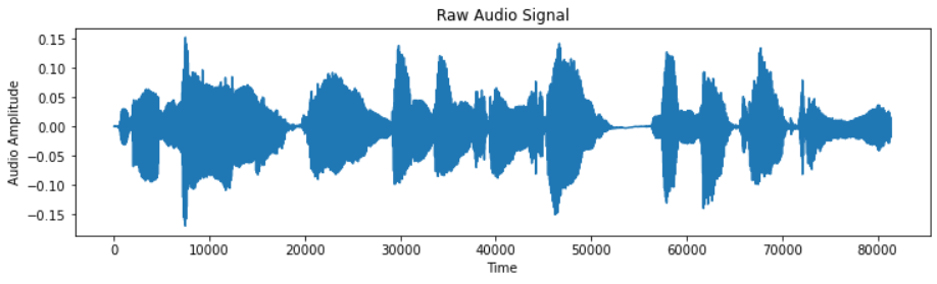
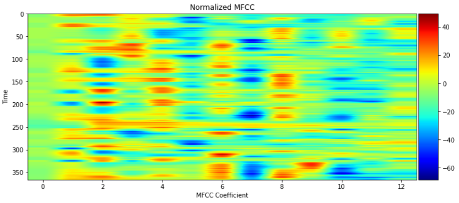
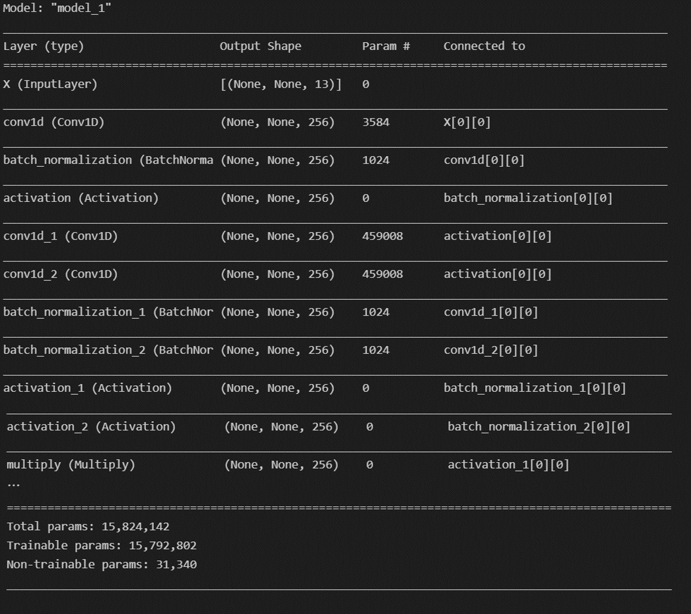
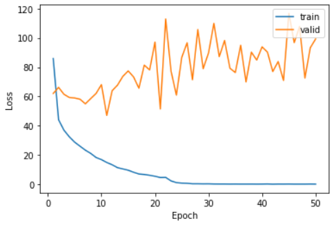

# Kaggle：Automatic-Speech-Recognition  
使用CTC LOSS  
以Python撰寫  
> [Training model](main.ipynb)  
> [Testing](test.ipynb)  

步驟
--
[0.環境設定](#0環境設定)  
[1.資料前處理](#1資料前處理)  
[2.模型建構](#2模型建構)  
[3.效果評估](#3效果評估)  
[4.改進](#4改進)  
[5.成果](#5成果)  
[6.參考資料](#6參考資料)

## 0.環境設定  
    Anaconda + jupyter notebook(or VScode)
    Tensorflow-GPU = 2.6  
    cuDNN = 8.1  
    CUDA = 11.2  
    Keras = 2.6  
    librosa  
    其他常用lib

建立環境 pip install -r requirements.txt  
[requirements](requirements.txt)  

## 1.資料前處理  
  
### 讀取wav與建立text  
    def get_wav_files(wav_path):
        wav_files=[]
        for (dirpath, dirnames, filenames) in os.walk(wav_path):
            for filename in filenames:
                if filename.endswith('.wav') or filename.endswith('.MAV'):
                    filename_path = os.path.join(dirpath, filename)
                    wav_files.append(filename_path)
        return wav_files

    #將label轉成TEXT
    def get_train_texts(wav_files,tran_path):
        tran_texts=[]
        for wav_file in wav_files:
            basename=os.path.basename(wav_file)
            x=os.path.splitext(basename)[0]
            tran_file=os.path.join(tran_path,x+'.txt')
            if os.path.exists(tran_file) is False:
                return None

            fd=open(tran_file,'r')
            text=fd.readline()
            tran_texts.append(text.split('\n')[0])
            fd.close()
        return tran_texts
    #設定音檔路徑
    wav_path='D:\\Python\\ML\\HW3\\ML@NTUT-2021-Autumn-ASR\\train\\'
    tran_path='D:\\Python\\ML\\HW3\\ML@NTUT-2021-Autumn-ASR\\train_txt\\'
    wav_files=get_wav_files(wav_path)
    tran_texts=get_train_texts(wav_files,tran_path)
  
### MFCC取樣  
    def load_and_trim(path):
        audio, sr = librosa.load(path) #audio為取樣的訊號值  sr為取樣率
        energy = librosa.feature.rms(audio) #計算每幀的均方根值(RMS)
        frames = np.nonzero(energy >= np.max(energy) / 5)
        indices = librosa.core.frames_to_samples(frames)[1]
        audio = audio[indices[0]:indices[-1]] if indices.size else audio[0:0]
        
        return audio, sr
  
### 進行特徵抓取  
    features = []
    for i in tqdm(range(len(wav_files))):
        path = wav_files[i]
        audio, sr = load_and_trim(path)
        features.append(mfcc(audio, sr, numcep=mfcc_dim, nfft=551))
        # nfft : FFT大小
        # highfreq : 最高頻帶邊緣，將超出的雜訊移除，可自行新增
#### Audio Signal  
  
#### MFCC 
  

### 標準化  
    # 避免出現權重比例失衡 造成難以收斂
    samples = random.sample(features, 100)
    samples = np.vstack(samples)

    mfcc_mean = np.mean(samples, axis=0)
    mfcc_std = np.std(samples, axis=0)
    print(mfcc_mean)
    print(mfcc_std)

    features = [(feature - mfcc_mean) / (mfcc_std + 1e-14) for feature in features]

### TEXT Encoder  
    #將TEXT進行編碼
    chars = {}
    for text in tran_texts:
        for c in text:
            chars[c] = chars.get(c, 0) + 1

    chars = sorted(chars.items(), key=lambda x: x[1], reverse=True)
    chars = [char[0] for char in chars]
    print(len(chars), chars[:100],"\n")

    char2id = {c: i for i, c in enumerate(chars)}
    id2char = {i: c for i, c in enumerate(chars)}    
  
### Create training and testing(validation) dataset  
    # training : validation = 9 : 1
    data_index = np.arange(len(wav_files))
    np.random.shuffle(data_index)
    train_size = int(0.9 * len(wav_files))
    test_size = len(wav_files) - train_size
    train_index = data_index[:train_size]
    test_index = data_index[train_size:]

    X_train = [features[i] for i in train_index]
    Y_train = [tran_texts[i] for i in train_index]
    X_test = [features[i] for i in test_index]
    Y_test = [tran_texts[i] for i in test_index]
  
### Create generator 
    # 進行分批訓練 以減少記憶體占用   
    # 設定batch_size大小 太大會造成OOM
    batch_size = 2
    def batch_generator(x, y, batch_size=batch_size):  
        offset = 0
        while True:
            offset += batch_size
            
            if offset == batch_size or offset >= len(x):
                data_index = np.arange(len(x))
                np.random.shuffle(data_index)
                x = [x[i] for i in data_index]
                y = [y[i] for i in data_index]
                offset = batch_size
                
            X_data = x[offset - batch_size: offset]
            Y_data = y[offset - batch_size: offset]
            
            X_maxlen = max([X_data[i].shape[0] for i in range(batch_size)])
            Y_maxlen = max([len(Y_data[i]) for i in range(batch_size)])
            
            X_batch = np.zeros([batch_size, X_maxlen, mfcc_dim])
            Y_batch = np.ones([batch_size, Y_maxlen]) * len(char2id)
            X_length = np.zeros([batch_size, 1], dtype='int32')
            Y_length = np.zeros([batch_size, 1], dtype='int32')
            
            for i in range(batch_size):
                X_length[i, 0] = X_data[i].shape[0]
                X_batch[i, :X_length[i, 0], :] = X_data[i]
                
                Y_length[i, 0] = len(Y_data[i])
                Y_batch[i, :Y_length[i, 0]] = [char2id[c] for c in Y_data[i]]
            
            inputs = {'X': X_batch, 'Y': Y_batch, 'X_length': X_length, 'Y_length': Y_length}
            outputs = {'ctc': np.zeros([batch_size])}
            
            yield (inputs, outputs)
  

## 2.模型建構  

### Bulid the model  
    epochs = 50 #訓練批次
    num_blocks = 3 #RNN的層數
    filters = 256 #輸出空間的維度

    X = Input(shape=(None, mfcc_dim,), dtype='float32', name='X')
    Y = Input(shape=(None,), dtype='float32', name='Y')
    X_length = Input(shape=(1,), dtype='int32', name='X_length')
    Y_length = Input(shape=(1,), dtype='int32', name='Y_length')

    # kernel_size : 1D卷積窗口長度
    # dilation_rate : 膨脹比例
    # Strides : 卷積的步長
    # causal : 使用膨脹卷積
    def conv1d(inputs, filters, kernel_size, dilation_rate):
        return Conv1D(filters=filters, kernel_size=kernel_size, strides=1, padding='causal', activation=None, dilation_rate=dilation_rate)(inputs)

    def batchnorm(inputs):
        return BatchNormalization()(inputs)

    def activation(inputs, activation):
        return Activation(activation)(inputs)

    def res_block(inputs, filters, kernel_size, dilation_rate):
        hf = activation(batchnorm(conv1d(inputs, filters, kernel_size, dilation_rate)), 'tanh')
        hg = activation(batchnorm(conv1d(inputs, filters, kernel_size, dilation_rate)), 'sigmoid')
        h0 = Multiply()([hf, hg])
        
        ha = activation(batchnorm(conv1d(h0, filters, 1, 1)), 'tanh')
        hs = activation(batchnorm(conv1d(h0, filters, 1, 1)), 'tanh')
        
        return Add()([ha, inputs]), hs

    h0 = activation(batchnorm(conv1d(X, filters, 1, 1)), 'tanh')
    shortcut = []
    for i in range(num_blocks):
        for r in [1, 2, 4, 8, 16]:
            h0, s = res_block(h0, filters, 7, r)
            shortcut.append(s)

    h1 = activation(Add()(shortcut), 'relu')
    h1 = activation(batchnorm(conv1d(h1, filters, 1, 1)), 'relu')
    Y_pred = activation(batchnorm(conv1d(h1, len(char2id) + 1, 1, 1)), 'softmax')
    sub_model = Model(inputs=X, outputs=Y_pred)
  
### 定義CTC loss  
    def calc_ctc_loss(args):
        y, yp, ypl, yl = args
        return K.ctc_batch_cost(y, yp, ypl, yl)

    ctc_loss = Lambda(calc_ctc_loss, output_shape=(1,), name='ctc')([Y, Y_pred, X_length, Y_length])
    model = Model(inputs=[X, Y, X_length, Y_length], outputs=ctc_loss)
    # 使用SGD最為優化器
    optimizer = SGD(learning_rate=0.02, momentum=0.9, nesterov=True, clipnorm=5)
    model.compile(loss={'ctc': lambda ctc_true, ctc_pred: ctc_pred}, optimizer=optimizer)
    # 設定checkpoint與lr_decay
    checkpointer = ModelCheckpoint(filepath='asr.h5', verbose=0, monitor='val_loss', save_best_only=True, mode='min')
    lr_decay = ReduceLROnPlateau(monitor='loss', factor=0.2, patience=1, min_lr=0.000)
  
### model Summary  
[The model Summary](modelSummary.txt)  
  
    
## 3.效果評估  

### 使用Loss 進行評估   
使用SGD，可以觀察到valid，會出現較大的震盪。  
可觀察到valid的loss沒有下降太多，因為使用CTC會使input與output長度相等，導致預測結果會產生-1，以補足輸出長度，最後造成loss計算上的偏差。  

    train_loss = history.history['loss']
    valid_loss = history.history['val_loss']
    plt.plot(np.linspace(1, epochs, epochs), train_loss, label='train')
    plt.plot(np.linspace(1, epochs, epochs), valid_loss, label='valid')
    plt.legend(loc='upper right')
    plt.xlabel('Epoch')
    plt.ylabel('Loss')
    plt.show()
 
  
 
  
## 4.改進  
    1. 加入highfreq 減少雜訊
    2. 增加epoch到100
    3. 增加RNN的layer與unit
    4. 改用LAS或RNN-T

    
## 5.成果  
  
### 預測結果(50 epoch)  
    True transcription:
    --  gua ma si kang khuan 

    Predicted transcription:
    -- gua ma si kang khuan 
  
### Kaggle Leaderboard
    Kaggle：Private Leaderboard (50/132)
 
  
   
## 6.參考資料
[CTC Example Github](https://github.com/philipperemy/tensorflow-ctc-speech-recognition)  
[CTC Keras](https://keras.io/examples/audio/ctc_asr/)  
[Speech Recognition--Hung-yi Lee](https://www.youtube.com/watch?v=AIKu43goh-8)  